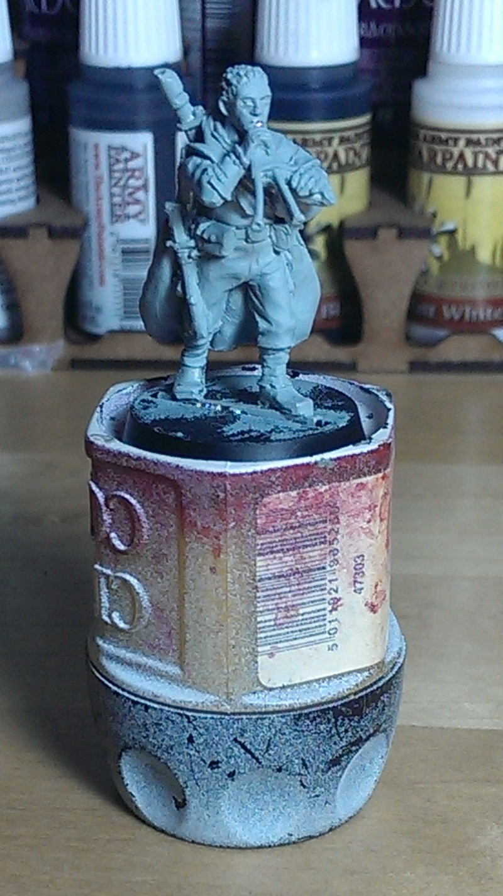
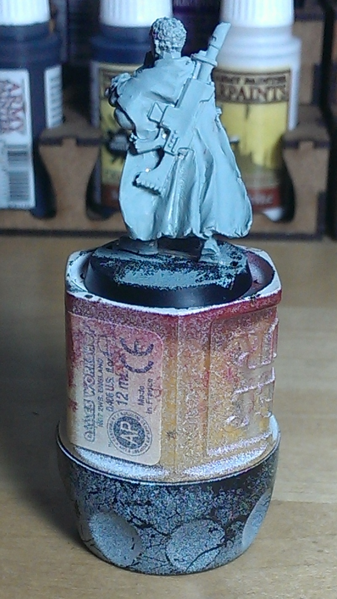
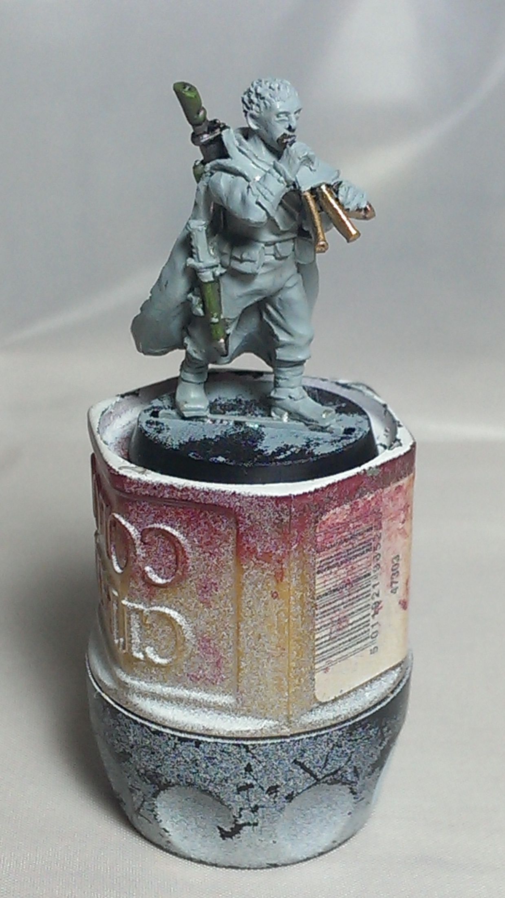
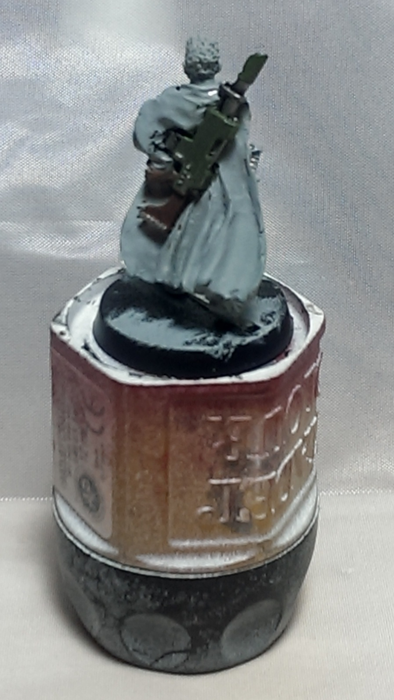
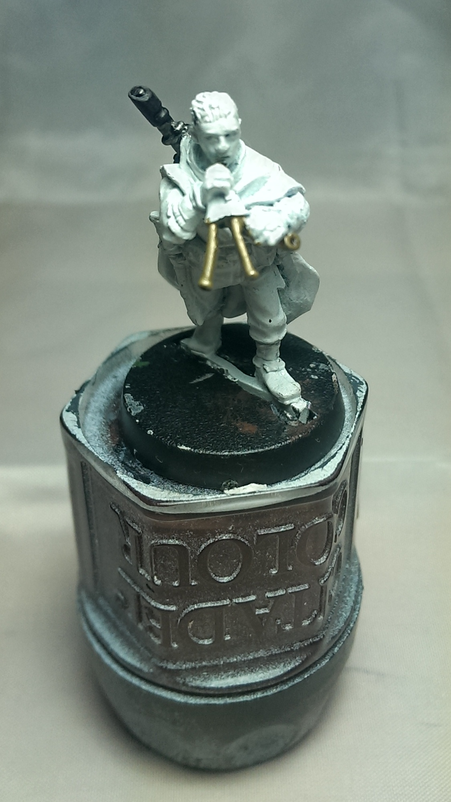
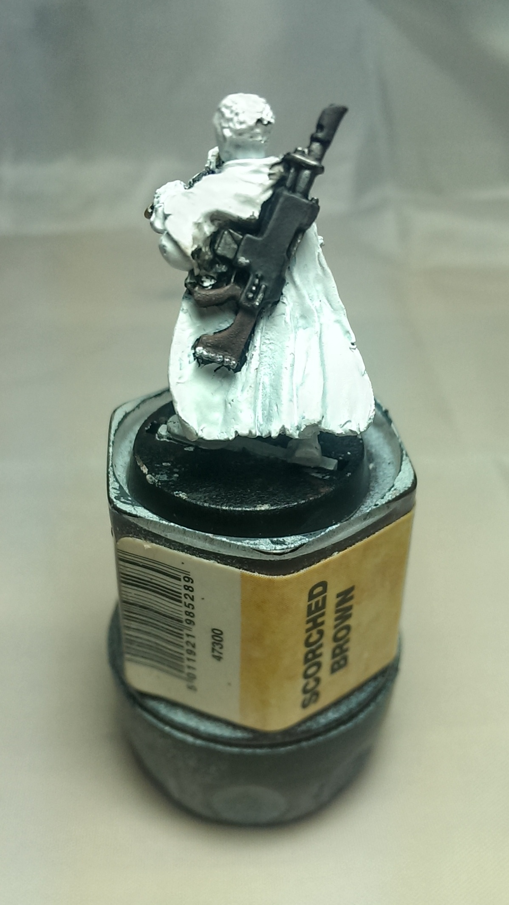

My friends and I have taken on a joint challenge for May - each of five of us is painting a Games Workshop 28mm miniature, a Gaunt's Ghost of Dan Abnett's books. My randomly assigned figure was Brin Milo. My personal rule was to try and stay source appropriate. Given I've now got about 5 days left to finish it and still call it a May challenge, I figured I should get on with it! On the up side, it's a 3 day bank holiday weekend. On the <strike>down side</strike> 2nd up side, my mother-in-law is coming to stay with us from France on Sunday, and we're all meeting up for tea on Monday, so finding painting time might be tricky. But onwards and downwards, I say!

My brand new LED bulbs for my halogen spots have both set themselves on fire and let out their magic smoke, so I'm down to just my main hobby light for taking pictures for now. I'll hopefully be able to get some nice ones for the final outcome.

<ul class="small-block-grid-1 large-block-grid-4">
	<li>
		<blockquote>First up - clean up and primer. The weather hasn't been co-operative of late, so my primer consists of a couple of coats of watered down astronomican grey. It's not feeling terribly robust as a primer, so we'll see how well the paint sticks. Or not.</blockquote>
	</li>
	<li>
		<blockquote>That lovely cloak just begging out for a nice camouflage scheme.</blockquote>
	</li>
	<li>
		<blockquote>So, first the pipes. Mixture of army painter bronze and an old pot of very light citadel shining gold over black basecoat.</blockquote>
	</li>
	<li>
		<blockquote>And the rifle. Mostly vallejo MC olive grey with MC olive green edge highlight. The wooden stock is army painter oak brown and fur brown with little lines drawn for wooden grain and as edge hilight, with a brown wash of army painter soft tone ink.</blockquote>
	</li>
</ul>

And yet, it didn't just feel right. The colours just weren't what I was after, and the stock especially looked plastic and not like wood at all - which is important, as the Ghost lasguns use nalwood, a tree from their dead world as their weapon stocks and furniture. It didn't help that when I rubbed the rifle with my thumb to clean up a slight overspill, the whole block of green came off, down to the bare metal! Back to the drawing board.

Fortunately, I have a bottle of brown dettol for just such an reason. The pine oil in it does a lovely job of lifting paint, especially fresh paint. Simple Green is great for yanks, but not so easy to get this side of the pond. So after an hour 'in the dip', with some disposable gloves and an old toothbrush the paint just scrubbed right off. A bit of water to rinse, and all shiny bare metal again. This time the weather stayed fair today, so was able to give a quick spray of cheap white plastic primer.

<ul class="small-block-grid-1 large-block-grid-2">
	<li>
		<blockquote>More of a brass effect this time, I think. This is mainly army painter shining silver with a bit of AP daemonic yellow plus some AP weapon bronze and old, old shining gold mixed in. Touch of dark brown in the holes at the end, done. Thin paint, so about 4 coats to build up the colour, heavier on the bronze on the first layers to get that coppery feel.</blockquote>
	</li>
	<li>
		<blockquote>Simple black scheme, though new paints to achieve it. First undercoated black, then reaper MSP 'dusky skin shade' basecoat on the black, AP gun metal on the barrel and sight, and reaper MSP 'dark shadow'. Simple AP strong dark tone (black) wash. Then the black flat areas were covered with dusky skin shadow again, and edge highlights with dusky skin. The wood was stippled with dark skin - using an actual stippling brush, to put some texture in - and a final edge blend with dark highlight. </blockquote>
	</li>
</ul>

MUCH better. The black body definitely works better. This is actually my first time using some new paints - Master series, from Reaper. The consistency is lovely to work with on a wet palette, very smooth and easy to handle - plus the triads, or at least the two I've tried here, are nicely balanced. Along with vallejo model colour, I think I may have found my new wunderpaint. Bit tricky to get hold of in the UK, and a bit pricey once you start doing everything as triads. Will have to do a review. Even seriously enlarged (even with painting in super close, they don't look that big!) I think the paint has come across lovely and smooth. So a definite win for reaper master series triads. Will tidy up the small mistakes on the metal - the camera shows things you can't see with the naked eye!

In the next part, I'll be doing the battledress and clothes; think I'll go with the dusty skin tone again and see how it comes out.