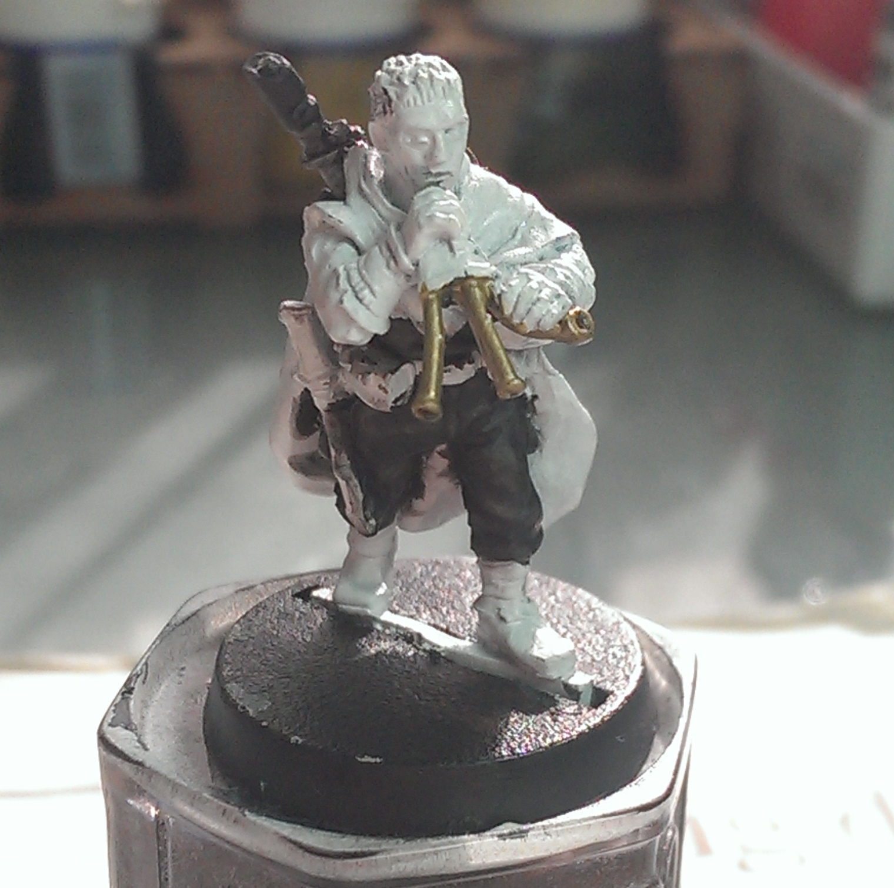

My friends and I have taken on a joint challenge for May - each of five of us is painting a Games Workshop 28mm miniature, a Gaunt's Ghost of Dan Abnett's books. My randomly assigned figure was Brin Milo.

[Part 1](../brin-milo-1/) | [Part 2](../brin-milo-2/)

I've relocated to another room - something about being able to use the dining table for dinner with guests, I think. Nice afternoon sun to paint with though! So, battle dress first.

<ul class="small-block-grid-1 large-block-grid-3">
	<li>
		<blockquote>Painted in Reaper MSP dusky skin shadow, then washed in Army Painter dark tone (black) wash. Next, roughly wet-blended with dusky skin shadow, dusky skin, and dusky skin highlight in successive stages.</blockquote>
	</li>
	<li>
		<blockquote>And this is why I love ink washes. A final wash with slightly watered down AP dark tone brings the final colour much closer back to black and blends the layers together for a much more subtle effect. They cover up so many sins!</blockquote>
	</li>
</ul>

What a difference taking photos by artificial light the next morning makes! Be good to get my lightbox working for consistent shots. Still, you can see the progress.

<ul class="small-block-grid-1 large-block-grid-3">
	<li>
		<blockquote>The green arm wraps, belt and rifle sling are done with vallejo model colour german field grey, highlighted with a mix of german field grey and model colour olive green, with more olive green added for the 2nd stage hilight. The arm wraps were also washed with AP dark tone - I think it may be a bit much on the left arm, will have to fix that. The belt buckle and knife handle are just AP gun metal washed with AP dark tone to get a darker metal effect. I will probably bring up the buckle with some brass/copper metallic, not sure yet.</blockquote>
	</li>
	<li>
		<blockquote>The boots and knife sheath are very simple - a mid tone red-brown (vallejo heavy siena) gives good coverage, and then a couple of successive AP dark tone washes to bring the colour down to a more subdued shade and add some depth. The puttees are the Foundry rawhide triad of paints (shade, base &amp; light) applied in order, covering less model with each section to hilight, and a AP soft tone (sepia) wash to tie them together. I did the same on the bagpipe bag, but decided I wanted to go a little lighter, so added the bottom two of the foundry boneyard triad (shade and base) to bring it to the more creamy colour, followed by another soft tone wash to blend the transition in better.</blockquote>
	</li>
</ul>

Being able to compare the reaper master series triads to the foundry triads was interesting on these parts of the model. I have to say, I haven't used my foundry triads that much; I find them too watery to use with a wet palette, and even straight from the pot you can end up with having to do three coats to get solid colour. That leads to a certain 'gritiness' to the paint. The reaper master series triad was a joy to work with; straight on a wet palette (because of the dropper bottle) it's just about thick enough to cover in one coat without being too thick to leave brush strokes, or can easily be watered to get a thinner coat for subtler blending, leaving a very smooth finish. I wouldn't be at all surprised to find they use flow improver in the mix - it certainly has that feel to it. The main downside is that the dropper bottles seem to clog much easier than the same style dropper bottle from both army painter and vallejo - I had to clear several of my reaper bottles with a pin right from the get go, and another has already part clogged again.

Triads are an expensive way to build an entire paint set, but they are definitely useful for colours you do a lot so you don't have to custom mix the shade and highlight every time. I do have some of the foundry highly rated skin triads, so we'll see how I get on with those in the next step.
