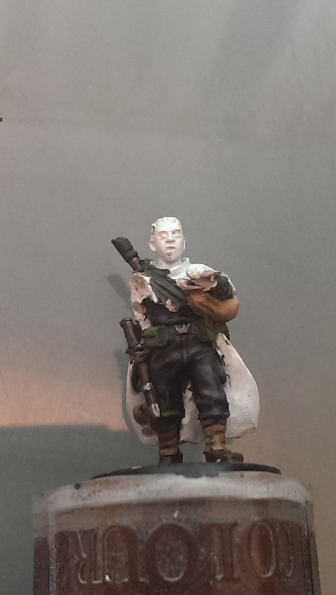
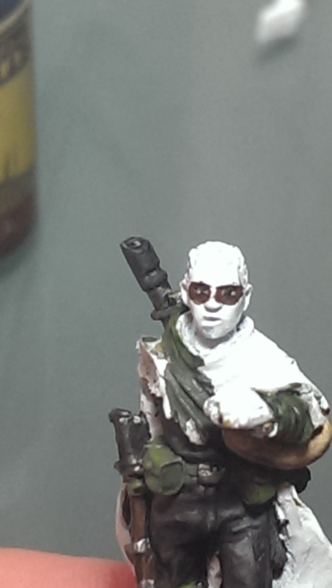
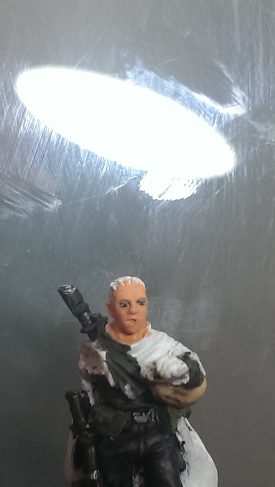
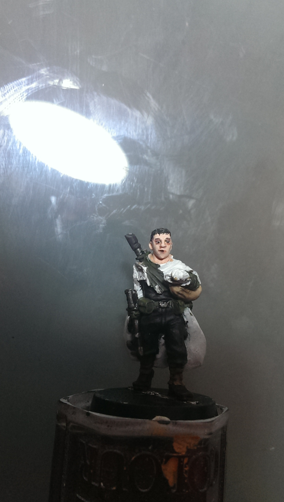
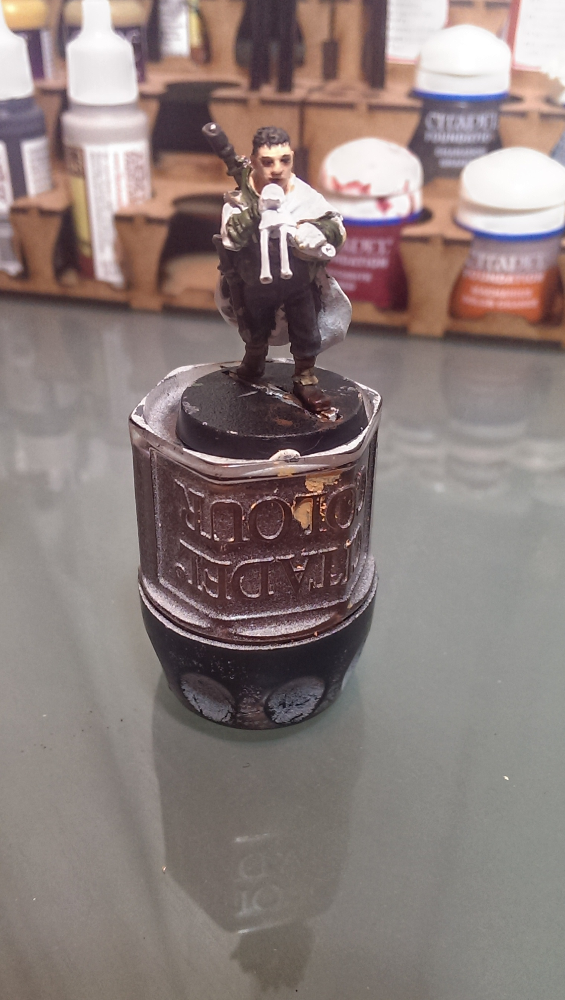
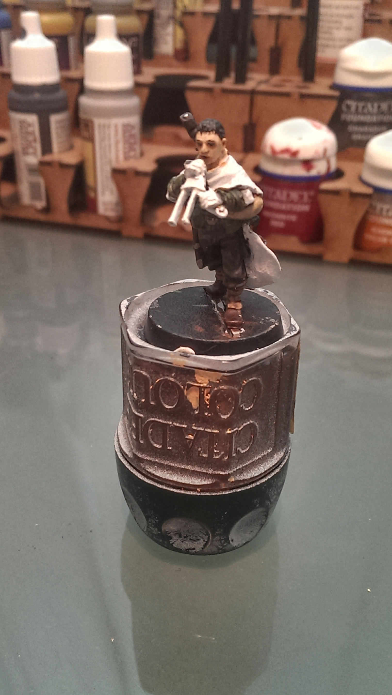

My friends and I have taken on a joint challenge for May - each of five of us is painting a Games Workshop 28mm miniature, a Gaunt's Ghost of Dan Abnett's books. My randomly assigned figure was Brin Milo.

[Part 1](../brin-milo-1/) | [Part 2](../brin-milo-2/) |  [Part 3](../brin-milo-3/)

I don't claim to be an expert painter by any means, nor are my hands that steady. But I've picked up a few tricks along the way. Every modeller I know hates painting eyes, especially for human-type figures as it's so easy to get something that sets off the 'uncanny valley' effect. We're just too good at recognising faces, so things you can get away with on mutants or orcs or zombies just look wrong in a human model. There are plenty of examples of painting eyes and faces for the Godlike exhibition class painters; this is a method that allows for mistakes and frankly, being a normal model painter while still producing something that doesn't make you a bit ashamed at how the eyes let your paint job down.

<ul class="small-block-grid-1 large-block-grid-4">
	<li>
		<blockquote></blockquote>
	</li>
	<li>
		<blockquote></blockquote>
	</li>
	<li>
		<blockquote></blockquote>
	</li>
	<li>
		<blockquote></blockquote>
	</li>
</ul>

<ul class="small-block-grid-1 large-block-grid-2">
	<li>
		<blockquote></blockquote>
	</li>
	<li>
		<blockquote></blockquote>
	</li>
</ul>
