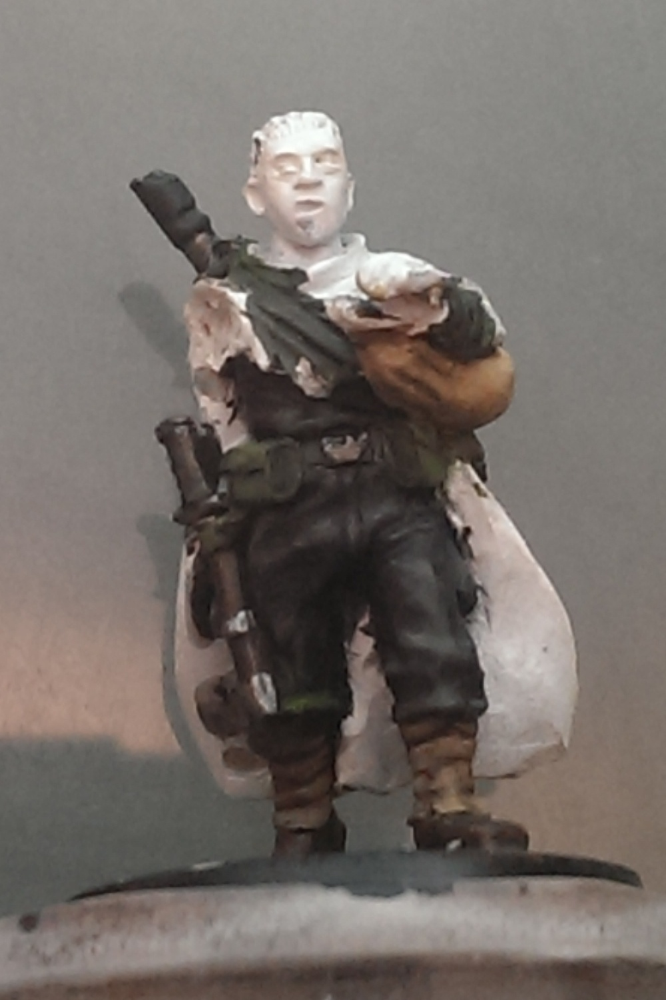
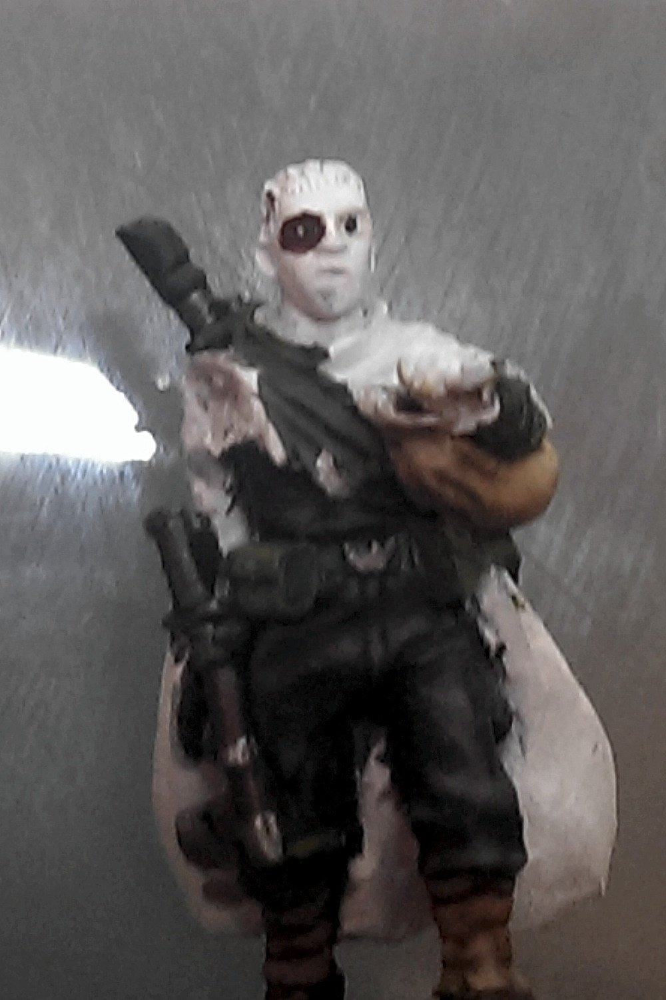
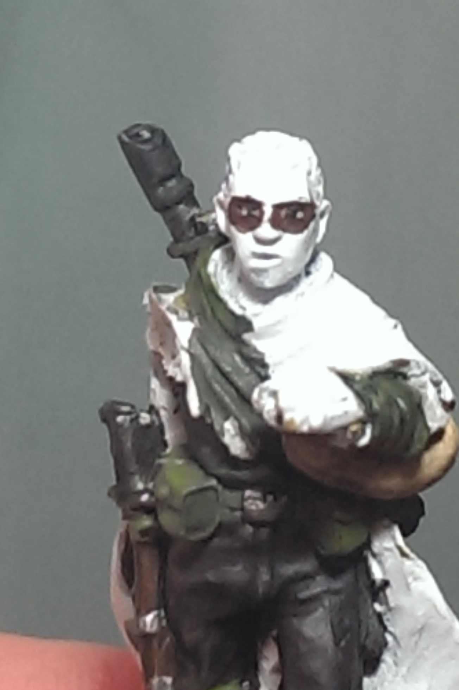
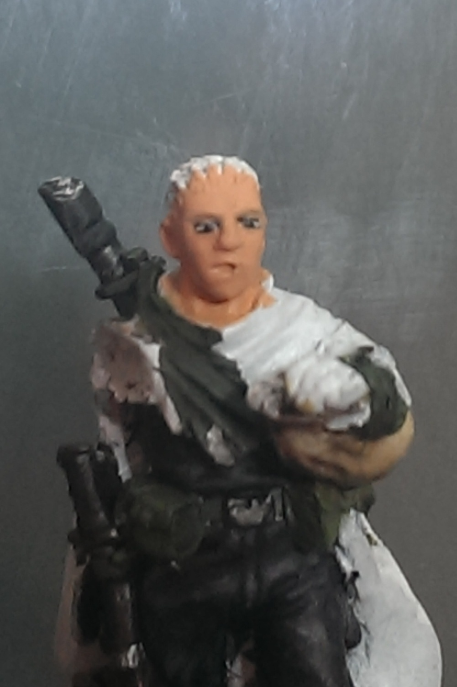
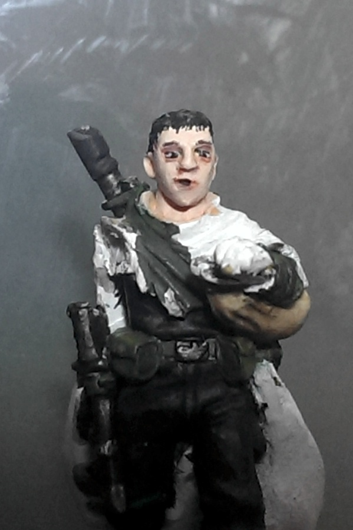
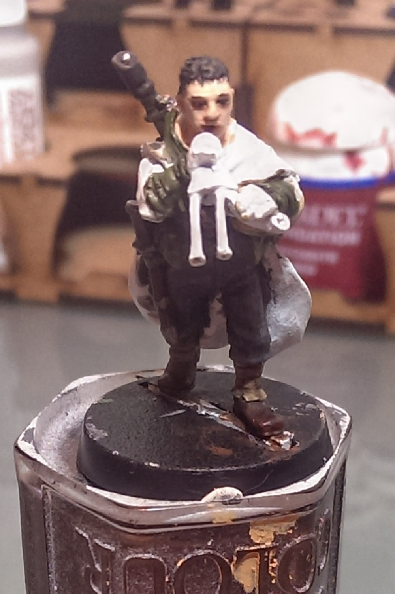

[Part 1](../brin-milo-1/) | [Part 2](../brin-milo-2/) |  [Part 3](../brin-milo-3/)

My friends and I have taken on a joint challenge (now overrunning into June!) - each of five of us is painting a Games Workshop 28mm miniature, a Gaunt's Ghost of Dan Abnett's books. My randomly assigned figure was Brin Milo.

I don't claim to be an expert painter by any means, nor are my hands that steady. But I've picked up a few tricks along the way. Every modeller I know hates painting eyes, especially for human-type figures as it's so easy to get something that sets off the 'uncanny valley' effect. We're just too good at recognising faces, so things you can get away with on mutants or orcs or zombies just look wrong in a human model. There are plenty of examples of painting eyes and faces for the Godlike exhibition class painters; this is a method that allows for mistakes and frankly, being a normal model painter while still producing something that doesn't make you rather ashamed at how the eyes let your paint job down. They are very hard even for experienced painters, so there's no shame in struggling with them! I still do.

The most important step is to do the eyes <strong>before</strong> the rest of the face. That way you can be a bit messy, and not paint over your lovely skin tones. Or if you mess it up, just try again, no loss. With this method it can even make sense to do the eyes as the very first step, before you paint any other part. That way, if you really mess up and your paint layers are starting to obscure the detail, a quick dip in the paint stripper or a rub with acetone won't destroy any other work. 

<ul class="small-block-grid-1 large-block-grid-3">
	<li>
		<blockquote>The first stage is to paint in the whites of the eyes. I use an offwhite shade (here, foundry boneyard 9c) as it ends up looking a little more natural than a straight white. You don't need to be precise, just cover up the whole eyeball/eyelid area. The only bit of this layer left showing will be in the corners, so make sure theres some there. Make sure your paint isn't too thick, or you'll obscure detail - slightly watered should do fine.</blockquote>
	</li>
	<li>
		<blockquote>I'm halfway between stages here. First, dot in the iris/pupils with some black paint with the tip of a very fine brush - a size 000 for example, or you can use the tip of a quality kolinsky sable brush like a raphael 8404. You can see this in the right-hand eye. It's fine to cross over any moulded eyelid, in fact it's better to. An alternative is to use a 0.2mm tip rollerball pen such as a Micron #005. The first pupil is easy - but getting the second one to line up looking in the same direction without looking cross-eyed can be a bit hard. With a steady hand, you can dot a pupil a bit larger if they're different sizes. You can always paint over one or both eyes with the offwhite again if you mess it up. One nice thing to do is to make the eyes look down the barrel of the weapon, or off to one side - you don't have to have everyone looking straight ahead. Here, I've painted them down a little lower so they'll end up looking up the pipes he's about to blow. </blockquote>
	</li>
	<li>
		<blockquote>OK, the next step is the 'panda' stage. Here, you paint in the shape of the eye itself. Use a dark brown, quite liquidy paint and finely tipped brush edge to outline the top and bottom of the eye as two curves - these will be the basis for the eyelid. Paint away from the eyeball with the end of the stroke, so you get a nice clean line instead of a smudge.

			Normally the top of the iris is hidden under the eyelid so you want to cross over the top of the iris you dotted earlier, otherwise the figure will look wild eyed and staring. Of course, if that's the look you're after, go for it. Where the bottom lid crosses the pupil, or if it just touches can help define how much the eyes are looking up or down - here, I crossed the bottom of the iris to make it look like the eye is looking downwards. If you need a tip for different shapes, make the expression you want in the mirror, and note where the iris meets your eyelids. Obviously try to mirror the look across both eyes. You can re-dot the pupil if it doesn't look right, and go over again with the brown, or even go all the way back to the whites of the eyes stage. Continue until you're happy with the eye shapes. But don't go insane trying for perfection, this photo is blown up several times over 'life size' on the 28mm figure, so they don't need to be 100% perfect to still look pretty good.</blockquote>
	</li>
</ul>

<ul class="small-block-grid-1 large-block-grid-3">
		<li>
		<blockquote>The next step is to go over the eyelids again, this time with your base flesh colour. Follow the same shape you've already done, but try to leave a little brown between the flesh layer and the eyeball - it delineates the shape of the eye, and gives the impression of eyelashes. For a thicker set of eyelashes (such as on a woman) leave a little more brown showing. Try not to paint flesh over the eyeball itself at this point, or you'll have to start over! Again, end your paint stroke moving away from the eyeball, so you don't end up with flesh where you don't want it. Once you've got the eyelids in place, go ahead and block in the rest of the face with the flesh colour. Here I'm using Foundry 5b flesh - not my favourite consistency to work with, it dries so damn quick, but the colour mix is pretty good, even if he does look like a mannequin at this point.</blockquote>
	</li>
	<li>
		<blockquote>And here I'm starting to block in the shadow and highlighting, using Foundry 5a and 5c flesh colours; shading around the nose and eyesockets and ears, and hilight along the cheeks, nose and forehead. I've also quickly painted in the black hair, with a couple of loose painted fine lines so it's not quite such a severe hairline. I wanted him to look fairly young, so I've been generous with the highlight - a bit too generous, possibly! You can also see the problems I'm having getting smooth coats with the Foundry paint, as it dries very quickly and goes a bit lumpy if you try to move it around much. The easiest way to see where the light and shadows should fall is to hold the figure up with a bright light overhead, such as your modelling lamp, and note where the shadows fall across the face. Then just paint those in!</blockquote>
	</li>
	<li>
		<blockquote>And the final result. The hair has had a mid grey highlight with a black ink wash. The face has had final highlights along the ridge of the nose and forehead with Foundry 5c mixed with a little white. Also - note the eyebrows! They're very common to forget, but make a subtle yet noticeable improvement to the face.</blockquote>
	</li>
</ul>

Overall, pretty happy with the outcome! Though I'm definitely going to be checking out Reaper MSP paint in flesh tones, not getting on with the flow characteristics of Foundry at all. If you have a steadier hand than me, you can do the iris stage in an actual colour, with a smaller black pupil dot, and even a white 'flash' highlight. You can also do a more defined shape of the face shading, such as this [excellent tutorial](http://www.paintrix-miniatures.com/articles.php?&art=7&page=1).