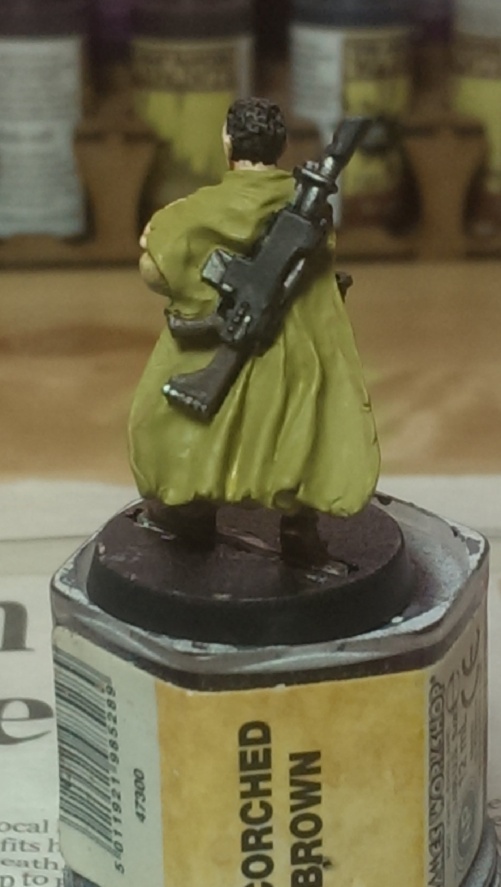
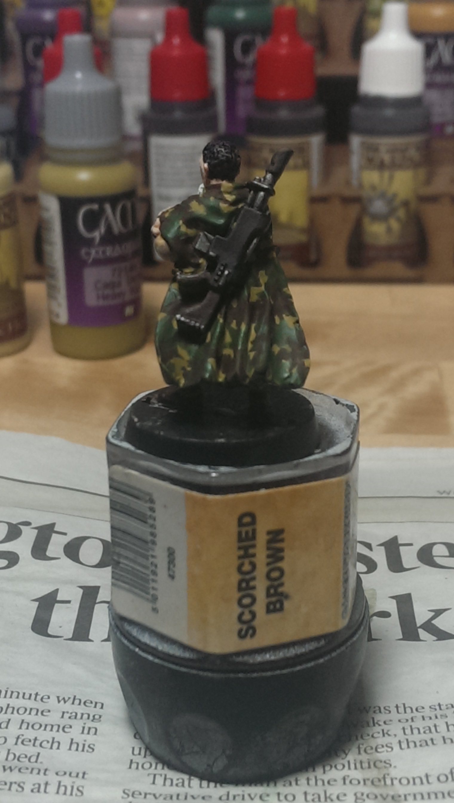
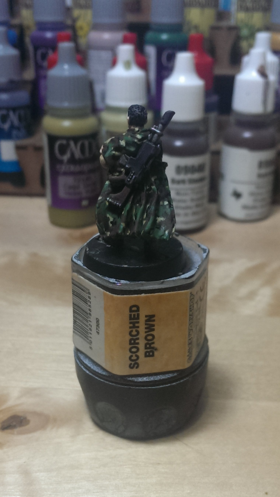
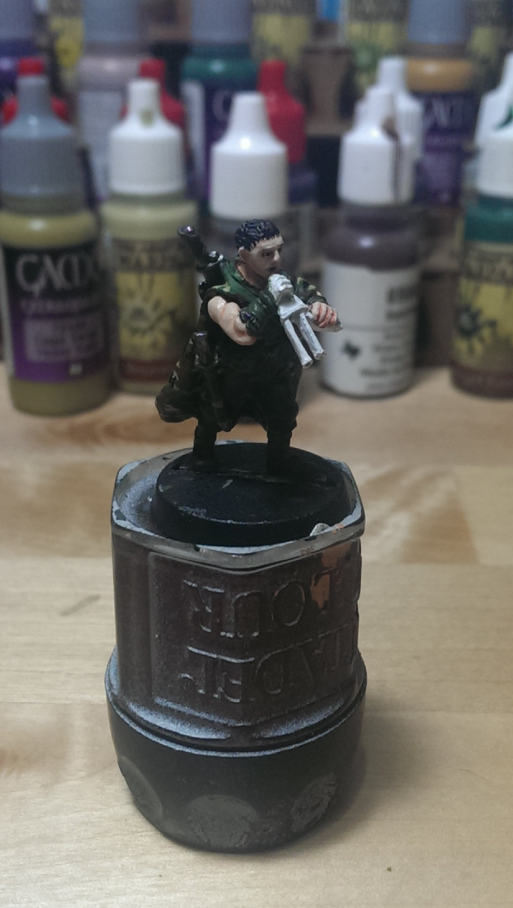
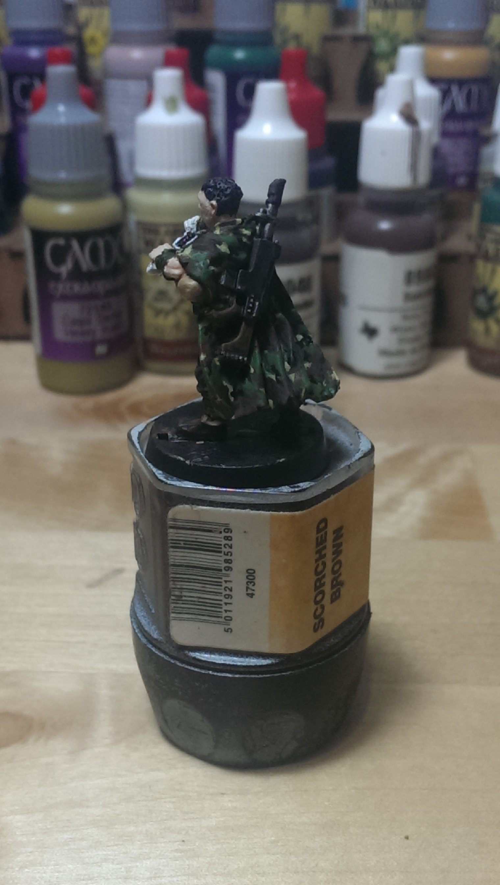

[Part 1](../brin-milo-1/) | [Part 2](../brin-milo-2/) |  [Part 3](../brin-milo-3/) |  [Part 4](../brin-milo-3/)

My friends and I have taken on a joint challenge for May (now finishing ASAP!) - each of five of us is painting a Games Workshop 28mm miniature, a Gaunt's Ghost of Dan Abnett's books. My randomly assigned figure was Brin Milo.

<ul class="small-block-grid-1 large-block-grid-4">
	<li>
		<blockquote></blockquote>
	</li>
	<li>
		<blockquote></blockquote>
	</li>
	<li>
		<blockquote></blockquote>
	</li>
	<li>
		<blockquote></blockquote>
	</li>
</ul>

<ul class="small-block-grid-1 large-block-grid-2">
	<li>
		<blockquote></blockquote>
	</li>
</ul>

