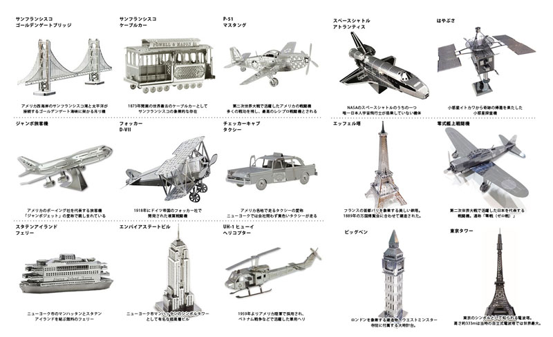
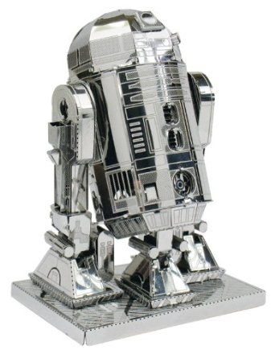
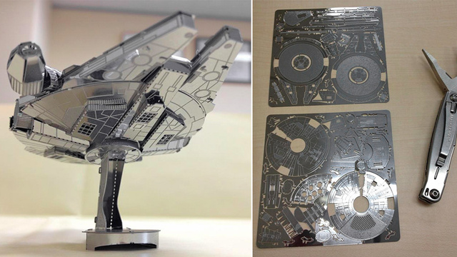

Tenyo Japan makes laser-cut thin metal sheet models ([nano puzzles](http://stores.ebay.co.uk/Magico-Japan/Metallic-Nano-Puzzle-/_i.html?_fsub=4292638014)!) that you assemble into a palm sized model with just cutters and a pair of needle-nosed pliers. And now, alongside Big Ben, biplanes, the space shuttle and Golden Gate bridge, they also do a mini millenium falcon and R2D2. Awesome!

### Just some of the many 'nano puzzles'

### R2-D2

### Millenium Falcon

Of course, finding either of the last two anywhere in stock outside Japan is a little trickier...