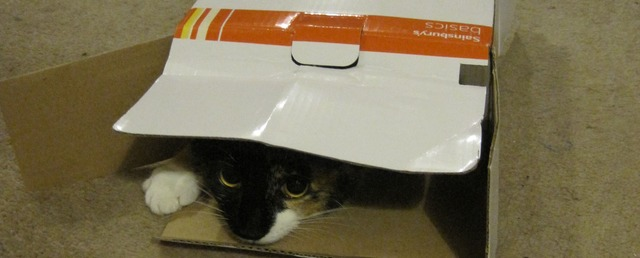

Hello world. After many years, getting back into the blogging game. Now I have something to post. 

But I need to write that stuff first. So this is an intervening post, to well, tide you over.

Looking at the logs, looks like there's still people using it for the avalon bits after the site being abandoned by me for so long - including the long hiatus when I'd lost the logins and the email account to get into it to pay the charges and re-enable the site. Wow. Colour me surprised. I thought this place would be long un-used and suitable to redo as virgin territory!

So guess I'll be fixing up those sections to work again properly too, after all. Some *serious* updates needed there - including modifying my new site design to include links!

Planning to keep and fixup these areas at least:

+ [Avalon area, including forum](/avalon)
+ [Avalon wiki](/ewiki)

But for the time being....
Oh look - kittens! In boxes! Click for more!

