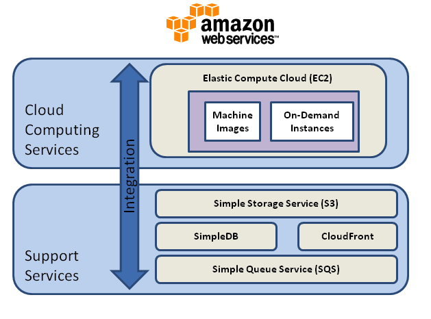

Given my heftily-priced-for-not-much-space hosting provider bill is due at the end of the month for another year, I decided to check out Amazon Web Services free hosting.

Basically, they give you a free virtual linux server for a year, along with a whole bunch of support stuff to go with it. Pretty good!

So I've moved this blog and the legacy stuff across to the new ubuntu 13.04 virtual server I've built there as a webserver. So instead of having to ftp upload files, I now have a fully armed and operational dedicated server with a real IP address I can run what I want on. So git, node.js and minecraft then.

Definitely going to write a guide on how I did it, just got to finalise a few bits first. And do it again, taking notes and screenshots this time! It's pretty straightforward, especially if you have prior linux and/or virtualization experience. Admittedly, those are kinda my day job, so your mileage may vary.

So hopefully there won't be too much disruption as I move the domain as well as the web-space, but just in case something goes belly up while dealing with the yanks in charge, the site is also available at
[theguildhouse.co.uk](http://www.theguildhouse.co.uk) as well as the usual [theguildhouse.net](http://www.theguildhouse.net)

