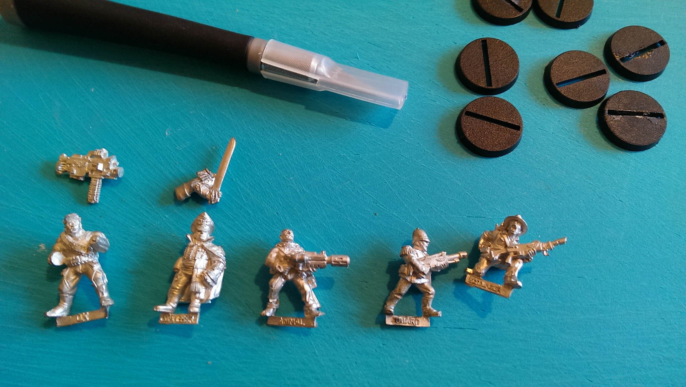
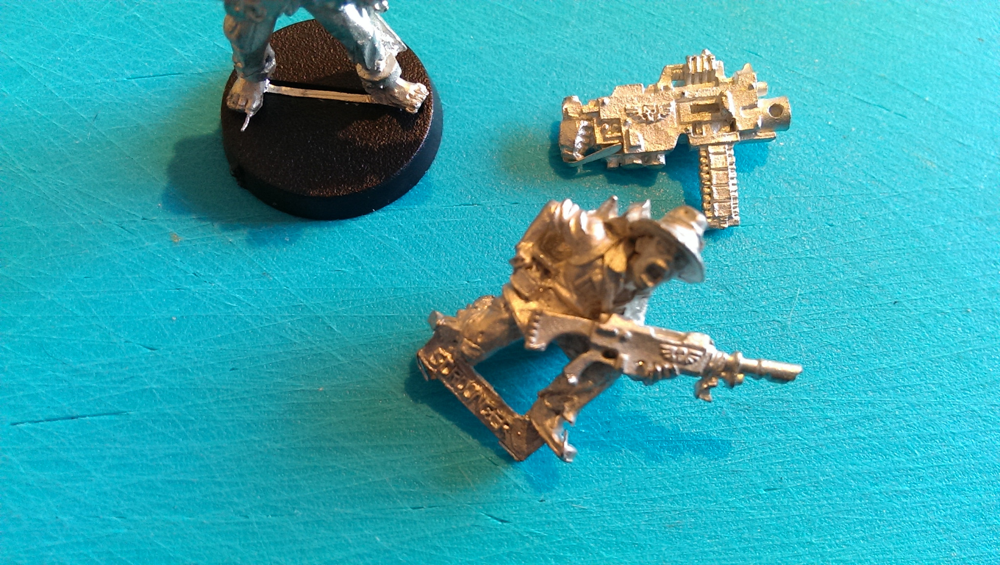
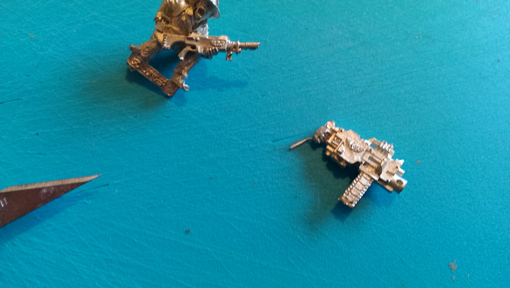
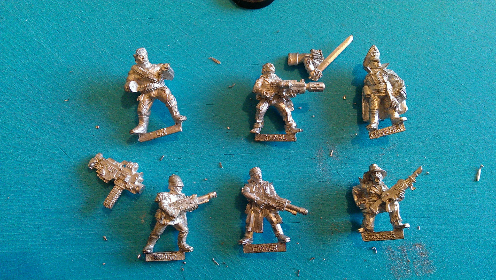
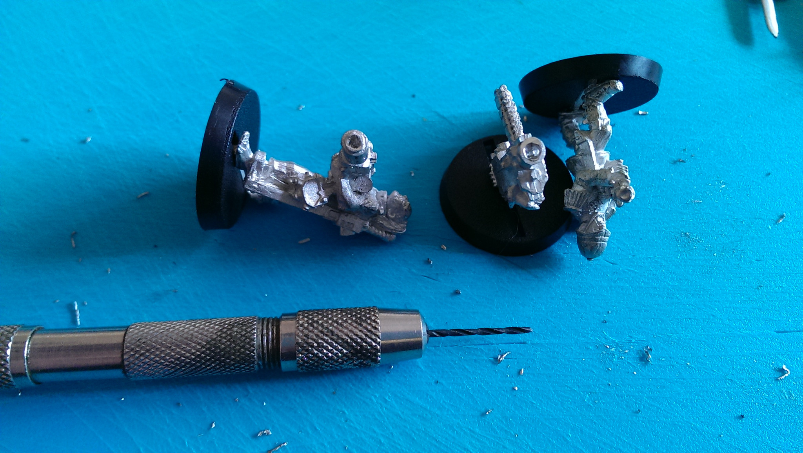
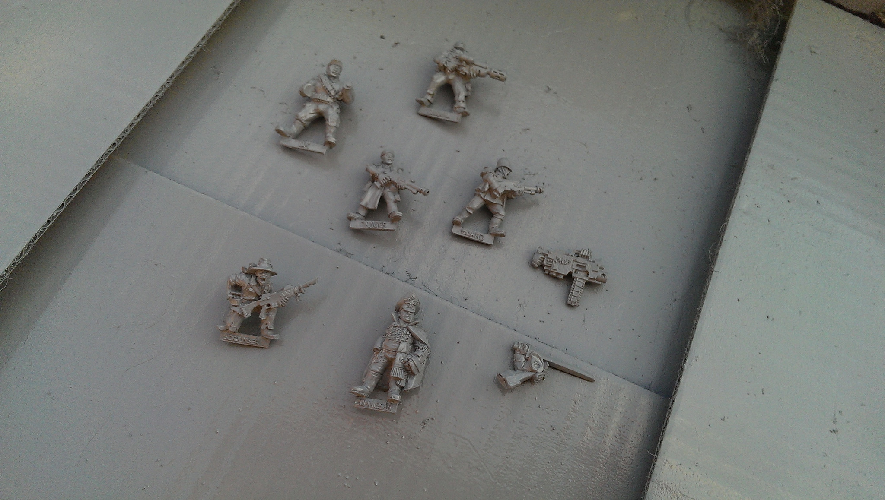
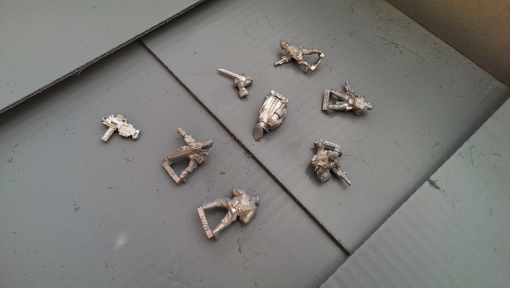
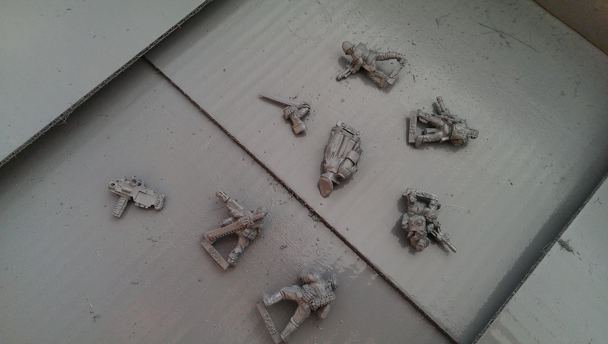

This is about some metal miniatures I dug out from the loft in order to demonstrate how to prepare and prime metal figs - compared to plastics - prior to full painting.

You used to be able to use these particular models as a veteran 40K Imperial Guard squad; no idea if that's still possible, but what the hell I might as do the first half - it's been a lot of years since I last painted any Guard!

Main differences in general:

 * Preparation. Metal figs have flash and mould lines. They need cleaning just like plastics, but given the material is different, a sharp knife is usually the best tool. Snips and files tend to leave marks on the softer metal, so use fine grade sandpaper if you need to smooth an area. You may also get small holes/misshapes, especially multipart kits, so you can sometimes need some milliput or the like to fill in gaps.
 * Metal is heavier, usually softer (depending upon alloy) - thus easier to kitbash/modify, and usually more expensive per model. You used to get a lot more variety with metal (cheaper to do small run castings) but plastics have come a long way in the last decade or two. Thin bits can be a bit bendy; just gently bend them back into shape.
 * They can often be coated with a little talc or oily mould release, so clean with warm soapy water first so your paint will get a good grip.

So - onto the example preparation!

	

	
<blockquote>Prior to any work - note the slotta bases to go with the tabs. I'm probably going to cut the tabs off and pin-base later; for now, they'll do for temporary painting bases (I always base up last)</blockquote>

 

	

	
<blockquote>Note the metal flash on the feet, and bottom of the hand for the heavy bolter</blockquote>

 

	

	
<blockquote>The bolter flash pulled out straight before cutting off</blockquote>

 

	

	
<blockquote>Cleaned up, flash removed, mould lines scraped off, and sword sanded. Note there's quite a lot of metal mess cut off. It's worth spending a bit of time doing this, as it will drastically improve the look of the final model.</blockquote>

 

	

	
<blockquote>Since I have a pin-vice handy, I drilled out most of the gun barrels. It's a small touch, but I like the look. Totally optional. Harder on the las-guns, as they have smaller barrels, so they only got a couple of turns of the bit.</blockquote>

 

With metal figures - always, always use a primer or undercoat. With plastics, you can get away with a basecoat as a primary colour, but metals are less 'grippy' of the paint, so without a proper primer you are much more likely to see paint flake off later in exposed areas. If you don't have a dedicated spray primer/undercoat, a thinnish coat of white, black or grey basecoat style acrylic paint will do at a pinch. It keys the surface for further layers, and gives you a solid colour to work from. Primer colour is personal preference - I tend to use black for darker figures, white or light grey for ones I want a brighter finish on.

Short break between rain clouds, so I nipped outside to spray primer. Car body primer works as a cheap option; I have some dedicated primer sprays, went with grey as painting light green over black is a right pain in the danglies. 

	

	
<blockquote>Shake the can properly first, do a test spray on the cardboard away from the figs (clears out any dry lumps), then short fast sweeps of spray at ~20cm to 30cm distance. Don't spray on a figure solid or you'll douse in paint and drown the detail (if you do do this, get it inside and rinse it under the tap quick, you should be able to get almost all of it off). I stick my box on a handy low wall, and that lets me spray from a couple of different angles so I don't end up with too many unprimed spots.</blockquote>

 

	

	
<blockquote>Some people do fancy things with string or sticks; I just lay em down outside in a spare cardboard box, spray one side, let it dry a bit, and flip em over.</blockquote>

 

	

	
<blockquote>And done. I'll wait for that to dry, look for any mould lines I missed (I usually do - they're easier to see once primed), scrape those off too, and touch up with manual brush to get a nice even primer coat.</blockquote>

Once they're primed, you just basecoat and paint as per usual.

